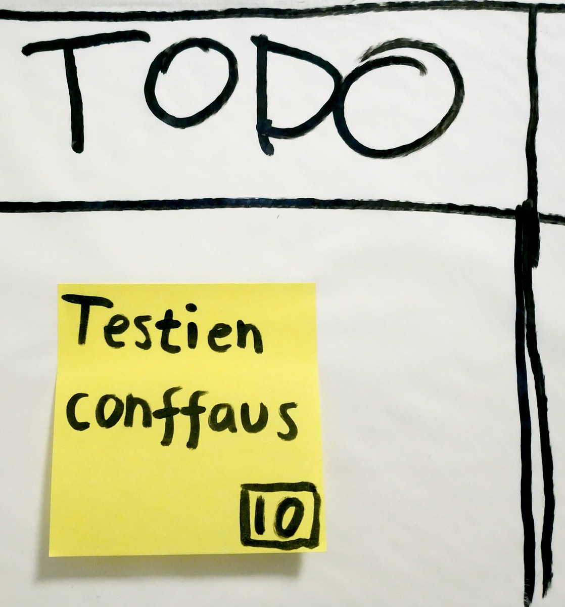
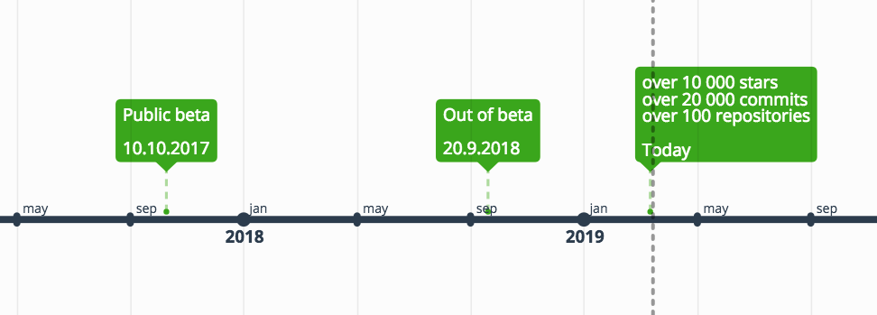
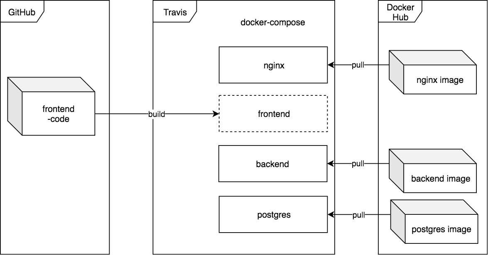

---
revealOptions:
  transition: 'slide'
---

## Cypress.io ja E2E: pintaraapaisu

_Olisiko teillä hetki aikaa puhua selaintestauksesta?_

---

## Olipa kerran tarve konffata testit

- Tuhansia rivejä koodia frontissa <!-- .element: class="fragment" data-fragment-index="1" -->
  * React & Redux <!-- .element: class="fragment" data-fragment-index="1" -->
- Saman verran bäkkärissä <!-- .element: class="fragment" data-fragment-index="2" -->
  * Node & Express <!-- .element: class="fragment" data-fragment-index="2" -->
- Uusia featureja tulossa <!-- .element: class="fragment" data-fragment-index="3" -->
- Tarve isoille refaktoroinneille <!-- .element: class="fragment" data-fragment-index="4" -->
- 0 testiä <!-- .element: class="fragment" data-fragment-index="5" -->

Notes:

- Vähä aikaa sitte mun tiimi peri projektin **`{space}`**
- tuhansia rivejä koodia frontissa, reactia ja reduxia
- about sama bäkkärissä
- uusia featureja tulossa
- tarvetta isoille refaktoroinneille
- 0 testiä

----

## Tutkimaan JS-testauskirjastoja

<video data-autoplay src="./assets/mita-helvettia.mov"></video>

Notes:
Ei kun vaan nettiin tutkimaan mitä kirjastoi kannattais käyttää, näytti about tältä

loppu: Joten syntyi lappu kanbanille...

----

 <!-- .element: style="max-height: calc(50vh)" -->

Notes:

- Millasia tunteita tää herättää?
- Mikä teil tulee ekana mieleen jos näkisitte tän teiän seinällä?

----

## Testauksen mielikuvia

- Testaussysteemien konffaus on vaikeaa ja kestää kauan
- Selaintestejä kirjoittaminen on tylsää <!-- .element: class="fragment" data-fragment-index="1" -->
- Testivirheiden debuggaus on kryptistä <!-- .element: class="fragment" data-fragment-index="2" -->
- End-to-end-testejä ei voi tehdä jos on frontti ja bäkki eri repoissa <!-- .element: class="fragment" data-fragment-index="3" -->
- Traviksen testivirheiden selvittäminen on vaikeaa <!-- .element: class="fragment" data-fragment-index="4" -->

Notes:

Itte ku tuijotin sitä lappua, mieleen tuli lähinnä tälläsii juttui.

Konffaus: selenium

- Lopussa:
  - Onneks kuitenki Slackkiin kilahti inspiraatio

----


---

## Cypress

- Kokonaisvaltainen selaintestaus-framework



Notes:

Oikeestaa voi kuvailla ku vaa kokonaisvaltasena testaus-frameworkkinä.
Cypress on aika uus, tuli betasta ulos viime vuoden lopussa, mut on kuitenki todella
hyvällä mallilla ja sen dokumentaatiot on tosi kattavat.

Mut, en **puhu** paljoo, vaan mielummin näytän.

----

## Testauksen mielikuvia

- Testaussysteemien konffaus on vaikeaa ja kestää kauan <!-- .element: class="fragment highlight-current-blue" data-fragment-index="1" -->
- Selaintestejä kirjoittaminen on tylsää
- Testivirheiden debuggaus on kryptistä
- End-to-end-testejä ei voi tehdä jos on frontti ja bäkki eri repoissa
- Traviksen testivirheiden selvittäminen on vaikeaa

Notes:

Palaten viel edelliseen.

Kuitenki nyt ku käydään läpi Cypressiä, käydään läpi samalla näitä harhaluuloja
ja katotaan miten Cypress ratkasee nää.

Aloitetaan ihan ekasta

----

<video data-autoplay src="./assets/selenium-troubleshooting.mov"></video>

Notes:

Kuinka moni muistaa tän sivun?

----

## Cypress

### Konffaus ei ole vaikeaa eikä kestä kauan

```bash
$ npm i --save-dev cypress
$ npx cypress open
```
<!-- .element: class="fragment" data-fragment-index="1" -->

```bash
# Start app
$ docker-compose up -d backend db
$ npm start
```
<!-- .element: class="fragment" data-fragment-index="2" -->

Notes:
1. Konffaus ei tosiaan ole vaikeeta.

**tee ekat kaks komentoo nyt, muista alhaalla seuraava workspace**

2. Sit vaa softa pystyyn ja ollaan valmiita kirjottelee testejä

----

## Testauksen mielikuvia

- ~~Testaussysteemien konffaus on vaikeaa ja kestää kauan~~
- Selaintestejä kirjoittaminen on tylsää <!-- .element: class="fragment highlight-current-blue" data-fragment-index="1" -->
- Testivirheiden debuggaus on kryptistä
- End-to-end-testejä ei voi tehdä jos on frontti ja bäkki eri repoissa
- Traviksen testivirheiden selvittäminen on vaikeaa

Notes:
Ja seuraavana **{space}**

Noh, testien kirjottaminen voi silti olla työlästä mut Cypress tekee siit kyl viihdyttävää

----

`integration/login.spec.js`

```js
const DEMO_DELAY = 0

describe('Login page', () => {
  beforeEach(() => {
    cy.visit('http://localhost:3000')
  })

  it('shows an error if username or password is missing', () => {
    cy.get('.loginpage-form input[name="username"]')
      .type('testertester', { delay: DEMO_DELAY })

    cy.get('.loginpage-form .loginpage-button')
      .click()

    cy.get('.notification')
      .should('have.text', 'Username or password is missing!')
  })
})

```

Notes:

Joten kirjotetaan meidän eka testi.
Täs on valmiina kirjautumiselle yks testi, demomielessä lisätty myös tuki hidastamiselle.

Huomaako muuten kukaan mitä tost puuttuu mikä ohtun selenium-kokeissa varmaan löytyis? Ei oo for-looppia joka uudelleenyrittää jos elementti ei oo ehtiny näytölle. Cypress automaagisesti odottaa et elementit ilmestyy ja feilaa testin jos ne ei ikin ilmesty.

**HOX**: Eka ilman delay, sit `DEMO_DELAY = 100`

----

## Testauksen harhaluuloja

- ~~Testaussysteemien konffaus on vaikeaa ja kestää kauan~~
- ~~Selaintestejä kirjoittaminen on tylsää~~
- Testivirheiden debuggaus on kryptistä <!-- .element: class="fragment highlight-current-blue" data-fragment-index="1" -->
- End-to-end-testejä ei voi tehdä jos on frontti ja bäkki eri repoissa
- Traviksen testivirheiden selvittäminen on vaikeaa

----

`integration/login.spec.js`

```js
  it('shows username and logout button in navbar after successful login', () => {
    cy.get('.loginpage-form input[name="username"]')
      .type('testertester', { delay: DEMO_DELAY })
    cy.get('.loginpage-form input[name="password"]')
      .type('testertester123', { delay: DEMO_DELAY })

    cy.get('.loginpage-form .loginpage-button')
      .click()

    cy.get('.navigation-bar-username')
      .should('have.text', 'kathleenmaloy')
    cy.get('.navigation-bar-logout-button')
      .should('have.text', 'Log out')
  })

  it('shows an error if credentials are incorrect', () => {
    cy.get('.loginpage-form input[name="username"]')
      .type('testertester', { delay: DEMO_DELAY })
    cy.get('.loginpage-form input[name="password"]')
      .type('asdk1234refd', { delay: DEMO_DELAY })

    cy.get('.loginpage-form .loginpage-button')
      .click()

    cy.get('.notification')
      .should('have.text', 'Username or password is incorrect!')
  })
```

Notes:
Joten lisätääs pari testii lisää.
Eka tarkistaa et jos kirjautuminen onnistuu, käyttäjänimi ja logout-nappi näkyy ylhäällä.
Toka tarkistaa et jos tunnarit oli väärin ni siit tulee virhe.

Huomatkaa et meidän ei tarvii `beforeEach`:issä kirjautua ulos.
Cypress tyhjentää keksit ja localStoragen ennen jokasta testia.

----

## Testauksen mielikuvia

- ~~Testaussysteemien konffaus on vaikeaa ja kestää kauan~~
- ~~Selaintestejä kirjoittaminen on tylsää~~
- ~~Testivirheiden debuggaus on kryptistä~~
- End-to-end-testejä ei voi tehdä jos on frontti ja bäkki eri repoissa <!-- .element: class="fragment highlight-current-blue" data-fragment-index="1" -->
- Traviksen testivirheiden selvittäminen on vaikeaa

Notes:

Meil ei nyt kauheesti oo tässä aikaa joten mennää suoraa syvään päätyyn. **`{space}`**
End-to-end testit. Nyt siirrytään hetkeks siis Cypressistä Devops-hommiin.

---

## E2E aka End-to-End-testaus

- Käsitteenä voi viitata pariin eri asiaan
  1. Testataan käyttötapaus alusta loppuun asti
    * Kirjautuminen -> Tuotelistauksen selailu -> Ostoskoriin lisäys -> Kassa -> Checkout
  2. Testataan sovellus "koko stackin läpi"
    * Selain -> Frontend -> Backend -> Tietokanta -> Backend -> Frontend -> Selain
    * "Black box"
      * Käytetään samaa käyttöliittymää jota käyttäjäkin käyttää
- Nyt puhutaan "koko stackin läpi" tapahtuvasta testauksesta

Notes:
End-to-end testaus käsitteenä voi tosiaan viitata oman käsityksen mukaan pariin eri asiaan. **(lue)**. Nyt seuraavaks kuitenki keskitytään puhumaan siitä miten saadaan tietokanta, bäkkäri ja frontti kaikki pyörimään testejä varten.

----

## Olipa kerran työmaa

- Frontend ja backend eri repoissa
  - Travis ajaa molemmat, puskee uudet Docker-kuvat DockerHubiin
- Tuotannossa docker-composella backendin tarvitsema PostgreSQL pystyyn
  - Lisäksi myös nginx reverse proxynä
    - studies.cs.helsinki.fi/projekti → localhost:1234
    - studies.cs.helsinki.fi/projekti/api → localhost:4321/api

- Miten saisi Traviksen ajamaan E2E-testit?

Notes:

Joten palataan taas kerran tähän projektiin jonka mun tiimi peri.

----

## Traviksen puukotusta

- Todellisuudessa nyt ollaan Traviksen käyttökohteen ulkopuolella
  - Oikeasti pitäisi selvittää esim. Jenkinsiä, Azure DevOpsia, CircleCI:tä, jne.

- Mutta...kuitenkin...
  - Mitä jos frontin Travis pistäisi kaiken pystyyn docker-composella ja sitten ajaisi Cypress-testit?

Notes:

Joten, kun Cypress ajaa testit frontendissa, mitä jos vaan pistäis frontin Traviksessa
docker-composella kaikki pystyyn?

Ja...näin me sit tehtiin **`{space}`**

----

## Traviksen puukotusta

 <!-- .element: style="border:none;box-shadow: none;" -->

Notes:

Joten travis vetää DockerHubista bäkkärin, tietokannan ja nginxin, ja buildaa uuden kuvan siit tänhetkisestä testattavasta koodista. Ja sit ajaa Cypressin testit.

Ja seuraavaksi sit paikallinen demo näistä. Traviksessa kestäis 5 minuuttia.

---

## Testauksen mielikuvia

- ~~Testaussysteemien konffaus on vaikeaa ja kestää kauan~~
- ~~Selaintestejä kirjoittaminen on tylsää~~
- ~~Testivirheiden debuggaus on kryptistä~~
- ~~End-to-end-testejä ei voi tehdä jos on frontti ja bäkki eri repoissa~~
- Traviksen testivirheiden selvittäminen on vaikeaa <!-- .element: class="fragment highlight-current-blue" data-fragment-index="1" -->

Notes:

Joten nyt ku saadaan testit ajettua koko stackin läpi Traviksessa, jää vaan viimenen klassikko.
Virheiden selvittäminen Traviksessa.

----

## Cypress

### Traviksen testivirheiden selvittäminen on helppoa.

- Screenshotit epäonnistuneista testeistä <!-- .element: class="fragment" data-fragment-index="1" -->
- Video koko testin ajosta <!-- .element: class="fragment" data-fragment-index="1" -->

- <!-- .element: class="fragment" data-fragment-index="2" --> [Build #652 failed](https://travis-ci.org/ohtuprojekti-ilmo/ohtuilmo-frontend/builds/498863535) <!-- .element: class="fragment" data-fragment-index="2" -->

Notes:
Viimesenä muttei todellakaa vähäisempänä fiitsuna mitä Cypress tarjoaa on se, **`{space}`**
että se osaa ottaa screenshotit epäonnistuvista testeistä ja videon koko testin ajosta.
**{space}** Katotaas yhtä epäonnistunutta ajoa.

---

## Testauksen mielikuvia

- ~~Testaussysteemien konffaus on vaikeaa ja kestää kauan~~
- ~~Selaintestejä kirjoittaminen on tylsää~~
- ~~Testivirheiden debuggaus on kryptistä~~
- ~~End-to-end-testejä ei voi tehdä jos on frontti ja bäkki eri repoissa~~
- ~~Traviksen testivirheiden selvittäminen on vaikeaa~~

----


Notes:

Slackkiin "joko cypress on tulilla" vastaus "no nyt on"

---

Kysymyksiä?