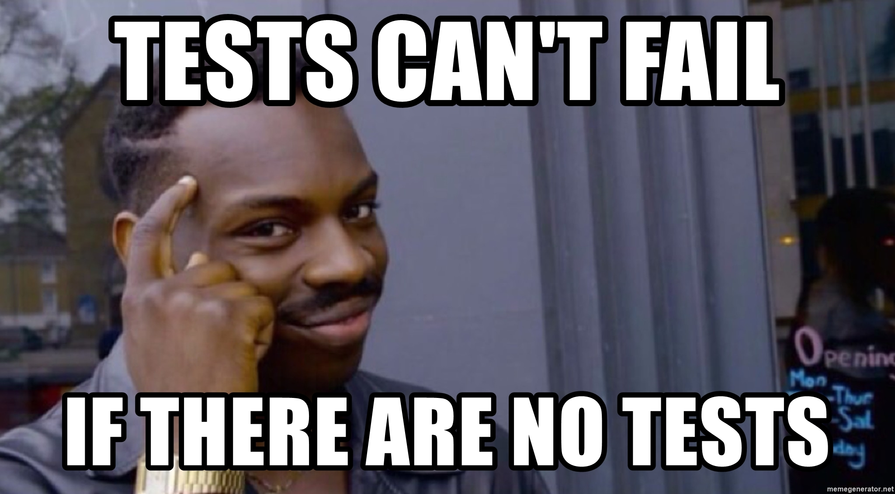
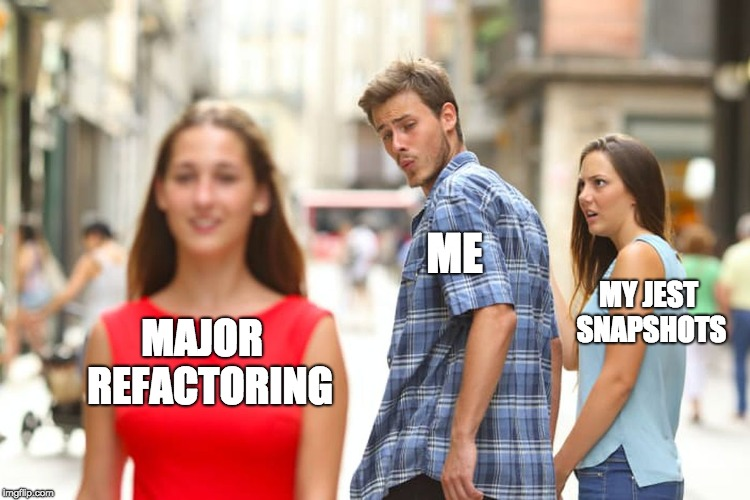
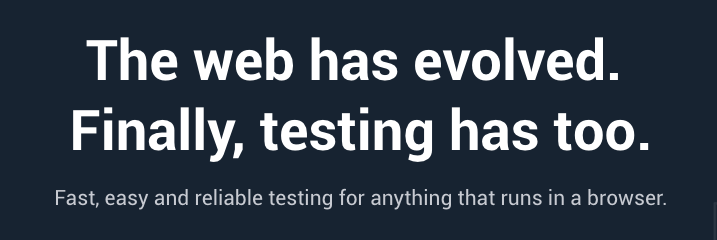
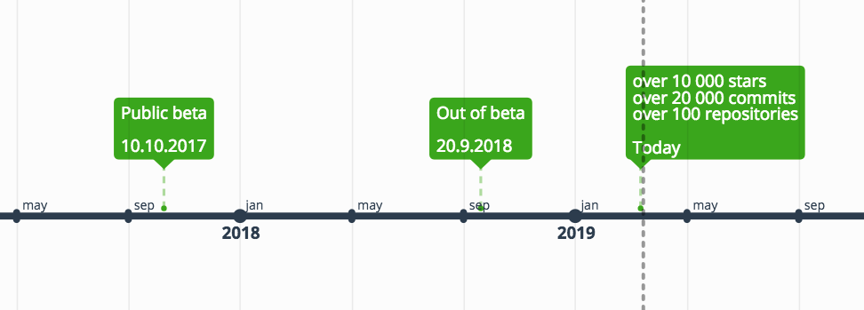
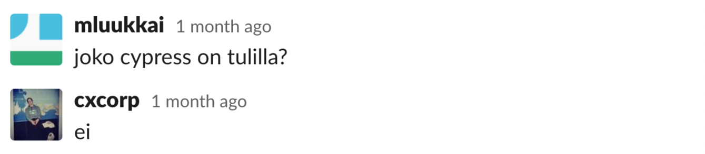

---
revealOptions:
  transition: 'slide'
---

# Cypress.js & E2E-testaus

Team ohtuilmon kokemuksia selaintestauksen työmaasta

---

## Sisältö

1. projektista
2. testauksesta
3. cypress
4. e2e + cypress
5. travis + cypress

---

<!--
.slide: data-background="./img/projektista-app-screenshot.png" data-background-opacity="0.3"
-->

## Projekti

- Ohjelmistotuotantoprojektien ilmoittautumissovellus
- Peritty edelliseltä ohturyhmältä
- Single-page app

  - React, Redux, Material-UI
  - Node, Express, Sequelize, PostgreSQL
  - nginx

- Edellisen ryhmän toteuttama testausratkaisu: <!-- .element: class="fragment" data-fragment-index="1" -->
  - ei ole <!-- .element: class="fragment" data-fragment-index="2" -->

Notes:

- lue pallot
- "ja tosiaan edellisen ryhmän testausratkaisu oli..."

---



Notes:

- joten meiän piti alkaa selvittää testien konffausta

---

## SPA:n testaus

Notes:

No mites Reactilla tehtyä äppiä nyt sit lähtis testaamaan

----

## SPA:n testaus

- Yksikkötestaus <!-- .element: class="fragment highlight-current-blue" data-fragment-index="1" -->
- Integraatio- ja E2E-testaus

Notes:

- Pitäis **olemassaolevalle projektille** tehä testit
- Ongelma: Suuria refaktorointeja horisontissa

----

### Yksikkötestaus

- Komponenttitason testit
- DOM-testaus
- Snapshot-testaus

```js
const clickFn = jest.fn()

describe('MyComponent', () => {
  it('button click should hide component', () => {
    const component = shallow(<MyComponent onClick={clickFn} />)

    component.find('button#my-button-two').simulate('click')

    expect(clickFn).toHaveBeenCalled()
  })
})
```

Notes:

- Harjoteltu Fullstackissä
- jes kiva ja helppo pystyttää
- mmmmmmmuttta

----



Notes:

- Hyvä varmistamaan ettei yksittäiset komponentit poksahda, mutta
  - Suuria refaktorointeja tulossa joten jouduttais kirjottaa kokonaan uudestaan
  - Testit deprekoitu heti ku ne on kirjotettu

----

## SPA:n testaus

- Yksikkötestaus <!-- .element: class="fragment highlight-red" data-fragment-index="1" -->
- Integraatio- ja E2E-testaus <!-- .element: class="fragment highlight-current-blue" data-fragment-index="2" -->

----

## Integraatio- ja E2E-testaus

- Selaintestaus <!-- .element: class="fragment" data-fragment-index="3" -->
    - Kattaa kuitenkin yksikkötestien osa-alueet <!-- .element: class="fragment" data-fragment-index="3" -->
    - Selenium, Puppeteer, PhantomJS, Nightwatch, Karma, Zombie.js, ...

Notes:

Käytännössä selaintestaus oli mitä tarvittiin

---

 <!-- .element style="border:none" -->


----

## Cypress

- Uusi, kokonaisvaltainen selaintestaus-framework



Notes:

En puhu paljoa vaan annan Cypressin näyttää

----

## Cypressin asennus

```shell
$ npm i cypress
$ cypress open
```
<!-- .element: class="fragment" data-fragment-index="1" -->

Notes:


---

<!-- .slide: data-transition="none" -->


---

<!-- .slide: data-transition="none" -->


